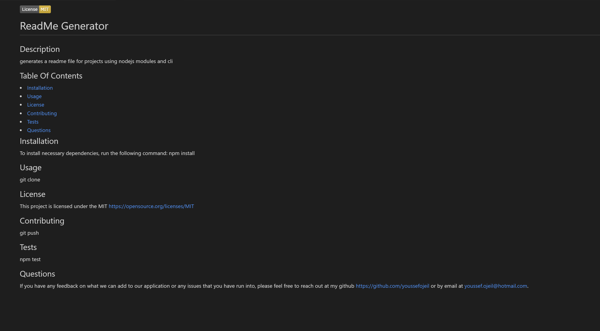

  [](https://opensource.org/licenses/MIT)
  # ReadMe Generator
  ## Description
  This project generates a generic readme file for users using the CLI and nodejs modules such as inquirer & filesystem

  ## Table Of Contents
<li><a href="#installation">Installation</a></li>
<li><a href="#usage">Usage</a></li>
<li><a href="#demo">Demo</a></li>
<li><a href="#license">License</a></li>
<li><a href="#contributing">Contributing</a></li>
<li><a href="#tests">Tests</a></li>
<li><a href="#questions">Questions</a></li>

## Installation
To install necessary dependencies, run the following command:
* npm
  ```sh
  npm install
  ```

## Usage
git clone

## Demo
[Video demonstration of command line application ](https://drive.google.com/file/d/1AHnjICrX9fxsZuV5NZ0wSWwAgNwvF-D7/view?usp=sharing)



## License
This project is licensed under the MIT https://opensource.org/licenses/MIT

## Contributing
git push

## Tests
npm test

## Questions
If you have any feedback on what we can add to our application or any issues that you have run into, please feel free to reach out at my github https://github.com/youssefojeil or by email at youssef.ojeil@hotmail.com.
